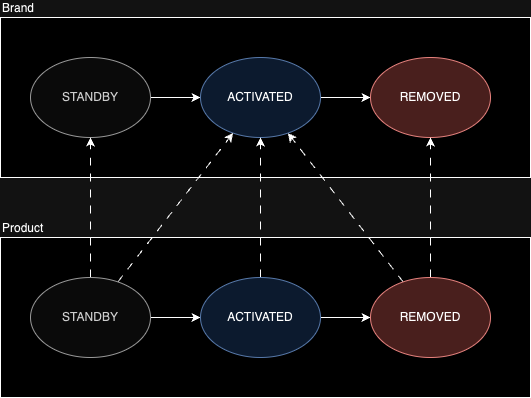

# [MUSINSA] Java(Kotlin) Backend Engineer - 과제

카테고리에서 상품을 하나씩 구매하여, 코디를 완성하는 서비스

## 구현 범위

1. 카테고리별 최저가격 브랜드와 상품 가격, 총액을 조회하는 API
2. 단일 브랜드로 모든 카테고리 상품을 구매할 때 최저가격 브랜드와 총액을 조회하는 API
3. 카테고리 이름으로 최저, 최고 가격 브랜드와 상품 가격을 조회하는 API
4. 브랜드 및 상품을 추가 / 업데이트 / 삭제하는 API

## 코드 빌드, 테스트, 실행 방법

### 필요 조건

- Java 17
- Gradle

### 빌드

프로젝트 루트 디렉토리에서 다음 명령어를 실행합니다:

./gradlew build

### 테스트

단위 테스트와 통합 테스트를 실행하려면 다음 명령어를 사용합니다:

./gradlew test

### 실행

애플리케이션을 실행하려면 다음 명령어를 사용합니다:

./gradlew bootRun

애플리케이션이 실행되면 `http://localhost:8080`에서 접근할 수 있습니다.

## 기타 추가 정보

프론트 페이지
http://localhost:8080

Swagger
http://localhost:8080/swagger-ui.html

## 상품 상태 관리

실선은 도메인의 상태 변화 방향을 나타내고, 점선은 브랜드의 상태에 따라 상품이 가질 수 있는 상태를 나타냅니다. 
브랜드의 카테고리에는 1개의 상품은 존재하는 조건을 만족하며 상품의 삭제가 가능해야 하기 때문에 위와 같은 상태를 가집니다. 
이에 따라 상품의 상태는 다음과 같이 관리됩니다.

- 브랜드에 카테고리별로 상품이 하나 이상 존재해야 브랜드가 `ACTIVATED`로 변경 가능합니다.
- 상품을 삭제할시, 해당 브랜드의 해당 카테고리에 다른 상품이 하나라도 남아있어야 삭제(처리)가 가능합니다.
- 브랜드가 `STANDBY` 상태일때는 상품을 `ACTIVATED`로 변경할 수 없습니다.
